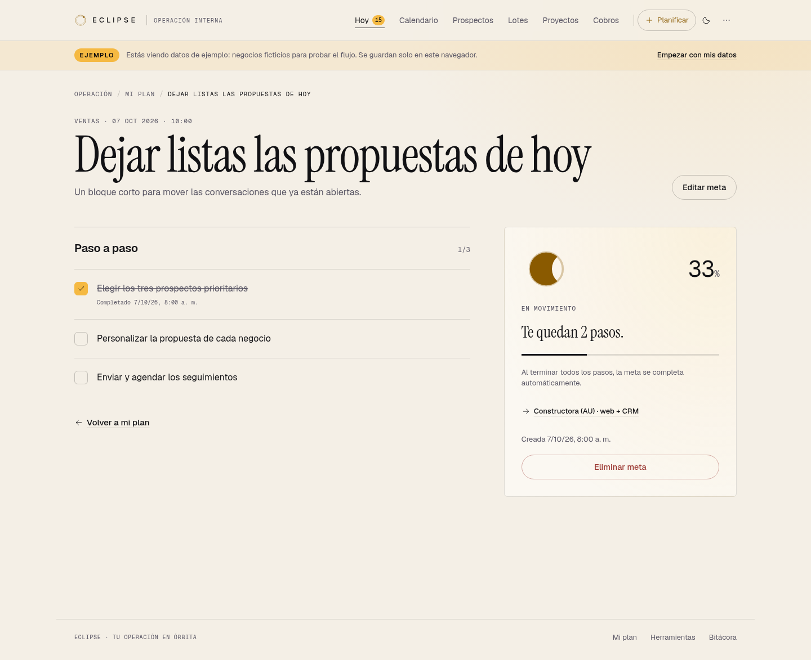
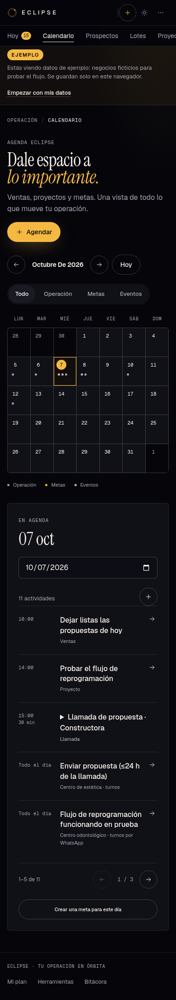

# Eclipse · Revisión visual

Capturas del portal con datos de ejemplo, hechas en Chromium. Tipografías locales Geist, Geist Mono e Instrument Serif; tonos originales de Eclipse; carga adaptada desde Eclipse-Web.

## Hoy · modo oscuro

Plan del día, metas, calendario y agenda de cinco ítems por página.

## Calendario · escritorio

Vista mensual, filtros y agenda del día con metas, hitos y eventos.

## Meta con subtareas · modo claro

Cada paso se puede marcar; terminar todos completa la meta y desmarcar uno la reabre.

## Generador por pasos

Pantalla completa, fases en el header, revisión final y botones para volver.

## Calendario · móvil

Mes compacto con indicadores de actividad y detalle del día debajo.

